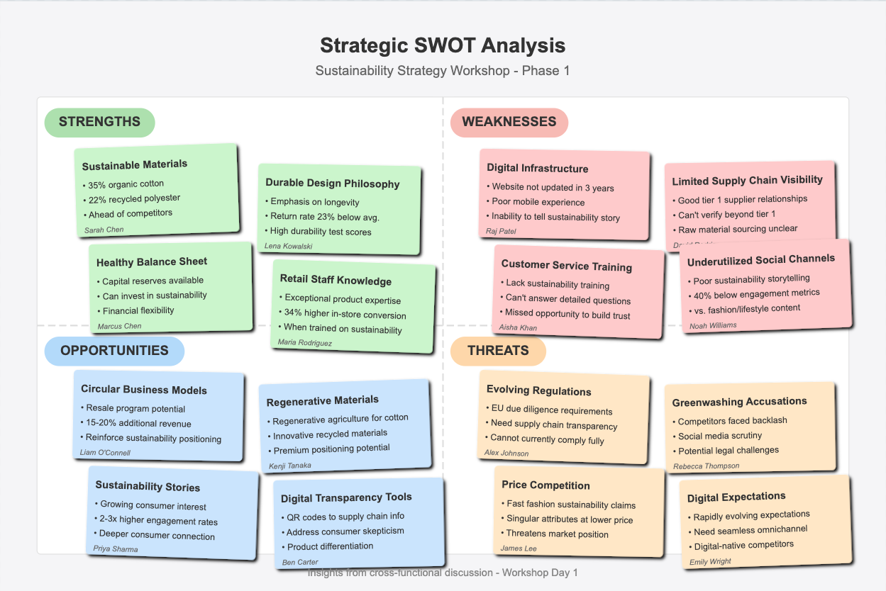

# SWOT Analysis Visual

This is a visual representation of the SWOT analysis conducted during Phase 1 of the workshop.

## About this visualization

This SWOT analysis visualizes the Strengths, Weaknesses, Opportunities, and Threats identified during the workshop session. The visual format helps participants better understand the relationships between different elements and serves as a reference point for strategy development. 