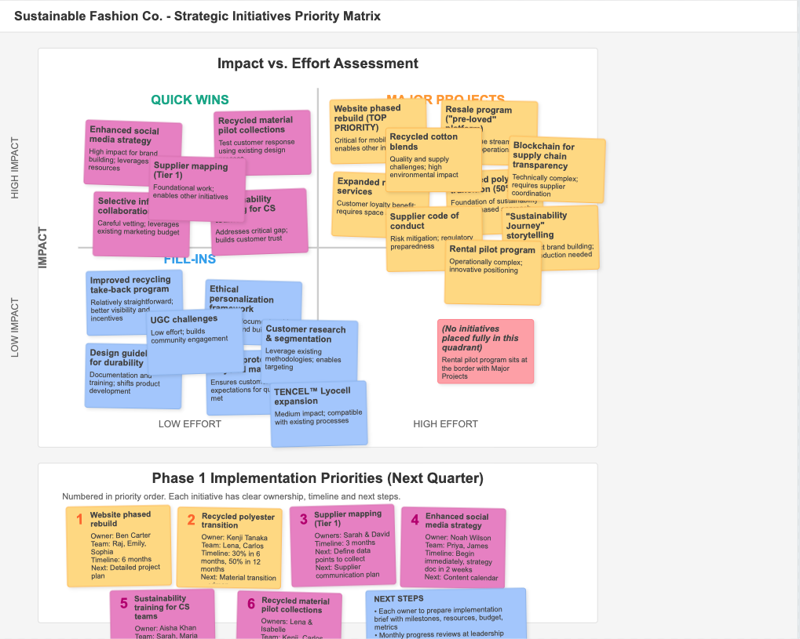

# Priority Matrix Visual

This is a visual representation of the Priority Matrix (Impact vs. Effort) developed during Phase 3 of the workshop.

## About this matrix

The Priority Matrix categorizes initiatives based on their potential impact and the effort required to implement them. This visualization helps stakeholders identify quick wins, major projects, fill-ins, and tasks that may need to be reconsidered or approach differently. It serves as a critical decision-making tool for resource allocation and strategic planning. 